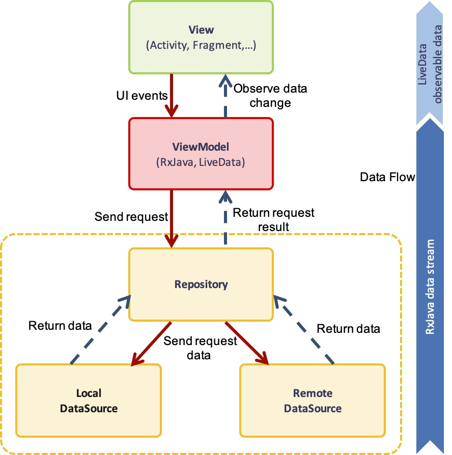

GST MVVM Application
=======================

## 1. MVVM Architecture

1. **LiveData** is an observable data holder class. Unlike a regular observable, LiveData is lifecycle-aware, meaning it respects the lifecycle of other app components, such as activities, fragments, or services. This awareness ensures LiveData only updates app component observers that are in an active lifecycle state.

2. **RxJava** for composing asynchronous jobs, support data stream and adds operators that allow use to compose sequences together. It makes business logic code clearer, and tidy.

*Updating...*